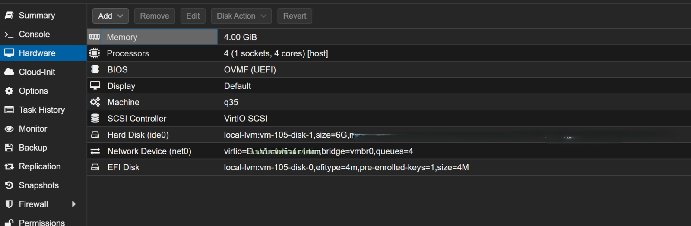

# 🚀 nics226tuneup

🛠 High-performance NIC tuning for Intel I226-V using Proxmox and MikroTik CHR/x86

This guide is written for CWWK N100 systems with:
- 🔌 4× 2.5G Intel I226-V
- 🔗 2× SFP+ Intel 82599ES

Goal: reduce latency, stabilize throughput, and improve packet processing.

---

## ⚙️ 1. NIC Tuning (Proxmox)

Edit the Proxmox network configuration:

    nano /etc/network/interfaces

Notes:
- Make sure NIC names match your system (enp1s0f0, enp2s0, etc.)
- Save: Ctrl + O
- Exit: Ctrl + X

---

### 🔗 Intel 82599ES (SFP+)

    auto enp1s0f0
    iface enp1s0f0 inet manual
        post-up /sbin/ethtool -K enp1s0f0 tso off gso off gro off tx off rx off
        post-up /sbin/ethtool -G enp1s0f0 rx 8192 tx 8192
        post-up /sbin/ethtool -C enp1s0f0 rx-usecs 0

    auto enp1s0f1
    iface enp1s0f1 inet manual
        post-up /sbin/ethtool -K enp1s0f1 tso off gso off gro off tx off rx off
        post-up /sbin/ethtool -G enp1s0f1 rx 8192 tx 8192
        post-up /sbin/ethtool -C enp1s0f1 rx-usecs 0

---

### 🔌 Intel I226-V (2.5G)

    auto enp5s0
    iface enp5s0 inet manual
        post-up /sbin/ethtool -K enp5s0 tso off gso off gro off tx off rx off
        post-up /sbin/ethtool -G enp5s0 rx 4096 tx 4096
        post-up /sbin/ethtool --set-eee enp5s0 eee off

    auto enp2s0
    iface enp2s0 inet manual
        post-up /sbin/ethtool -K enp2s0 tso off gso off gro off tx off rx off
        post-up /sbin/ethtool -G enp2s0 rx 4096 tx 4096
        post-up /sbin/ethtool --set-eee enp2s0 eee off

    auto enp3s0
    iface enp3s0 inet manual
        post-up /sbin/ethtool -K enp3s0 tso off gso off gro off tx off rx off
        post-up /sbin/ethtool -G enp3s0 rx 4096 tx 4096
        post-up /sbin/ethtool --set-eee enp3s0 eee off

    auto enp4s0
    iface enp4s0 inet manual
        post-up /sbin/ethtool -K enp4s0 tso off gso off gro off tx off rx off
        post-up /sbin/ethtool -G enp4s0 rx 4096 tx 4096
        post-up /sbin/ethtool --set-eee enp4s0 eee off

---

## 🌉 2. Proxmox Bridge Configuration

Make sure bridge name and bound NIC are correct.

The post-up line, one for each bridge

    auto vmbr0
    iface vmbr0 inet manual
        bridge-ports enp1s0f0
        bridge-stp off
        bridge-fd 0
        bridge-vlan-aware yes
        bridge-vids 2-4094
        post-up /sbin/ethtool -K vmbr0 tso off gso off gro off tx off rx off

---

## 📈 3. Increase Network Buffers

Edit sysctl configuration:

    nano /etc/sysctl.conf

Add:

    net.core.rmem_max=4194304
    net.core.wmem_max=4194304
    net.core.rmem_default=262144
    net.core.wmem_default=262144
    net.ipv4.tcp_rmem=4096 87380 4194304
    net.ipv4.tcp_wmem=4096 65536 4194304
    net.core.netdev_max_backlog=5000
    net.core.default_qdisc=fq
    net.ipv4.tcp_congestion_control=bbr

Apply:

    sysctl -p

---

## 🧠 4. MikroTik CHR VM / X86 VM Optimization

Network Device:
- Remove firewall=1
- Add multiqueue = number of CPU cores
- Model: VirtIO (recommended) or E1000 (optional)

Storage Controller:
- Select VirtIO SCSI
- Do NOT select VirtIO SCSI single

.
---

## 📝 Notes

- Optimized for low latency and high PPS
- Ideal for MikroTik CHR, firewall, and routing workloads

---

## 🧠 5. Disable ASMP

    nano /etc/default/grub

    GRUB_CMDLINE_LINUX_DEFAULT="... intel_idle.max_cstate=1 pcie_port_pm=off pcie_aspm.policy=performance"

    update-grub

## ❤️ Credits

- Proxmox VE
- MikroTik RouterOS
- Intel NIC tuning community

   

